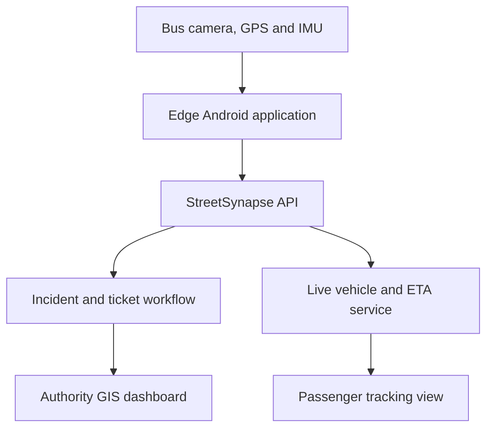

# Architecture

## Product principle

One onboard device produces two useful data streams:

- Urban events for authorities
- Vehicle positions for passengers and transport operators

## Edge responsibilities

1. Capture frames and timestamped location readings.
2. Run the compact road-hazard model locally.
3. Confirm a detection across multiple frames.
4. Preserve a small evidence crop or clip.
5. Queue events offline and retry safely.
6. Send lightweight GPS pings separately from incident evidence.

## Backend responsibilities

1. Validate authenticated vehicle data.
2. Merge spatially and temporally close detections.
3. Maintain incident and ticket state.
4. Stream fresh vehicle positions to clients.
5. Calculate stop ETAs from route progress and travel-time history.
6. Preserve model version and audit information.

The starter backend uses in-memory data and a Haversine distance calculation. The production milestone will replace these with PostgreSQL/PostGIS and persistent authentication.

## MVP boundary

Included now:

- Pothole, damaged surface, and waterlogging events
- GPS evidence
- Basic duplicate suppression
- Incident status changes
- Live vehicle positions
- A single demonstration route and ETA

Deferred until the core flow works:

- Garbage-bin overflow
- Streetlight operational status
- Full ANPR and evidence workflow
- Multi-agency road ownership routing
- Production cloud deployment

